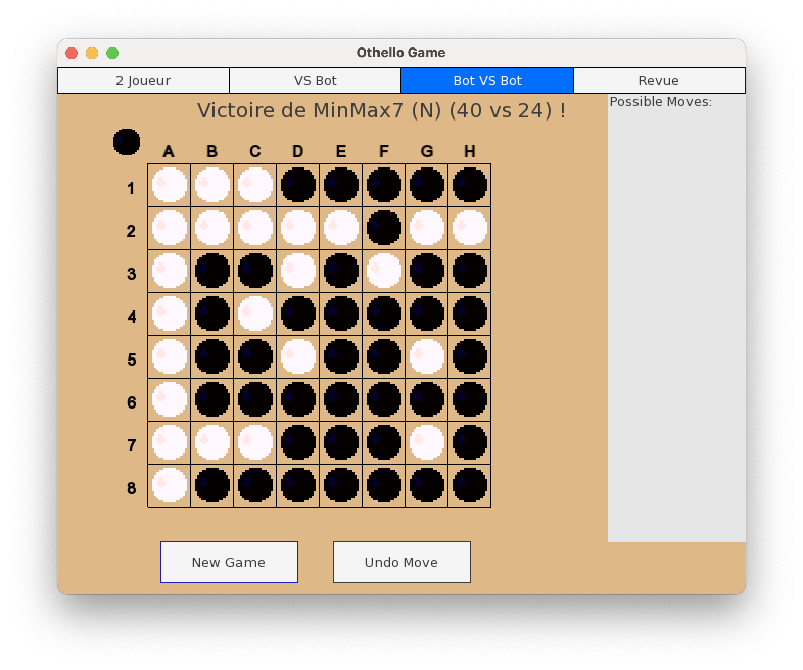

# AIthello

## Overview

This project aims at creating an high-performance AI for the Othello game. 

For this purpose, it explores various technics
such as minmax tree research (with optimization) with simple hand made heuristics
or neuronal network powered heuristics
but also prefer tree search for variating height research.

My approach to this project is to do everything from scratch without external libraries (excpet for the SFML).

This project is still on going : some features are not finalized (especially the neuronal network powered heuristics) and lacks some features such as MonteCarlo tree search.

## What is Othello ?

### Rules

Othello is a board game for 2 players where the objective is to have as many pieces of your color as possible. The twist is that your pieces can be flipped (therefore swithcing colors) if your opponent traps it between two of its pieces.

You can find all the rules on [Wikipedia](https://en.wikipedia.org/wiki/Reversi). If you are french, I encourage you to check the [FFO website](https://www.ffothello.org/othello/regles-du-jeu/).

### What interest ?

Othello is a complex game as the position can really quickly change. There is no simple way to evaluate a position and there are too many possibilities to explore them all.

This is why this game has interested many programmers which have developped very good AI (for example [Egaroucid](https://github.com/Nyanyan/Egaroucid)).

## My approch

The AI creation has gone through many steps :
 1. Creating a minmax tree search algorithm and optimizing it with alphabeta cut and MTD(f).
 2. Creating a prefer tree search algorithm (exploring first the branch with the best winning probability).
 3. Testing simple hand made heuristics (score based ones and mobility based ones).
 4. Creating heuristics through machine learning : 
    - Articially augmenting the research by fitting a minimax evaluation.
    - Learning by copying master moves.

This project is mainly me exploring how to train an AI and how tree search algorithms work. 

### Note on Prefer tree search

The idea of the Prefer tree search algorthm gave the motivation to start this project : I really wanted to test it !!

This tree search algorithm works by following at each step the most probable path. 

For this, you need a probability function (in my case, I'm using softmax based on my heuristics) and then calculate the probability of a branch by multiplying the probability of each ropes alongs the branch. To get the final evaluation, you just use a minimax tree search on the created tree.

This allows me to explore the most interesting part of the tree in greater depth while still exploring early branches as the products favores the nodes nearest to the source. 

Experience shows that this algorithm is less effective than an optimized minmax tree search.

### Note on AI training

I had trouble generating training data and making my neural networks converge. Therefore, I haven't finalized a satisfactory heuristic through ML yet.

## Testing the project

To build the project, I recommand downloading the all project (keeping the structure)
and using the CMakeLists.txt file to compile it.

If you want, you can unset the variable `IS_GRAPH` to disable the graphical interface for easier compilation.

The variable `IS_GEN` allows for data generation.

When launching the project, you will be faced with a terminal like interface.

This functions just like a terminal. The main commands are `play` and `train [nb_pass] [size_batch]` and `test`.

If you are lost, please use `help` or `help [cmd]` to get details.

## Acknowledgements

I have found a lot of usefull information on the [FFO website](https://www.ffothello.org/) concerning basics [strategies](https://www.ffothello.org/othello/principes-strategiques/) and [common algorithms](https://www.ffothello.org/othello/principes-strategiques/).

The random generator used in this project is the xoroshiro128+ PRNG. It has encapsulated in a class `Random` to make switching PRNG as easy as possible (for example for a Mersenne Twister).

The code uses two auxiliary librairies :
 - `Terminal.hpp` : a librairy I created to make customizable terminals.
 - `NL` : a librairy I created for creating neuronal networks and training them. It lacks many optimizations but is functional.
